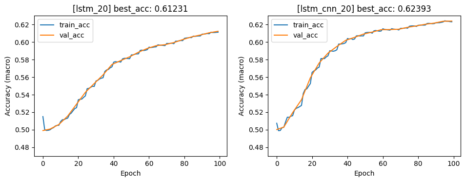
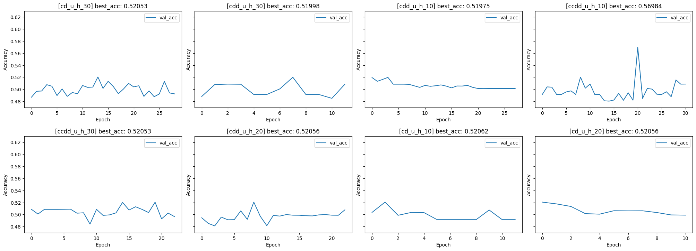

# Multi FX

## Next thing to do

[-] The construction of `multi-fx` is changed. It now satisfies the time constrain. But I have to re-run it (Meta method and `NHITS`)
[-] I am re-analyzing metrics obtained from `multi-fx` and other datasets in `./pretrained/analyze.ipynb`
- I also have to implement `DistillBERT`

## New `dataloader.py`

- I changed the old file `preprocess.py` into `dataloader.py`
- I also changed all function in the old file into OOP in the new one
- For normal datasets (not really multi-task, like `USD/JPY`), we just divide it normally (each task = a period of time)
- For `multi-fx`
    - Each pair is divided into 2 part (by time), part 1 for training and part 2 for validating/testing
    - 60 pairs are then divided into 120 tasks. 60 pairs of part 1 are used for training, 30 pairs of part 2 for validating, 30 ones for testing
    - Therefore, we now have 3 folders in pre-trained regarding to `multi-fx`: first one is `old_multi_fx` which contains pre-trained models for only close price. second one is `old/multi_fx` which contains pre-trained models for all prices, but the time constrain is not guaranteed. third one is `./pretrained/multi_fx` which contains the pre-trained models and guarantees the time constrain
- `REG` is no longer my concern.

## `CLF` and `REG`

- The problem is that I have to perform the regression task on new data. I was aware this at the beginning of the project and designed a part of its to be easy to scale (data and based-model). But later on, I was tired and designed the meta-model in stupid way
- I have to change them back to the scalable version, which I can switch between `CLF` and `REG` easily. First step is to change:
    [v] The way we compute metric in `common.py`
    [v] The way we load data in `dataloader.py` (renamed from `pre_process.py`): I change it to class
    [v] `main.py`: The return stuff of `run(.)` function should be a dictionary containing all metrics. The logging function should be independent from the content it has to write
    [v] I also use the `itertools` to wrap up those for loop in `submit_jobs.py`
    [-] In `meta_model.py`, we have to change thing to scalable version, but not for this commit, I think I will get back for it later
    [v] In `baseline_models.py`: it's reconstructed the way `main.py` and `submit_jobs.py` are
    [v] The problem is that I haven't tested these code yet. But I will create a commit for them on Github first

## Explain for the fluctuation in metrics

- My very first version for meta-evaluating was constructed as follows:

    data batch (compute exactly) --> dataset (**compute mean of batch**) --> task batch (compute mean of task) --> final (compute mean of task)

- The current version:

    data batch (compute exactly) --> dataset (**compute exactly**) --> task batch (compute mean of task) --> final (compute mean of task)

- This is why there exists a quite big fluctuation in metrics (from ±0.06 to ±2.4). But ±2.4 is better in describe the metrics

## [v] Some explanation about `pretrained`

- `baseline`: Contain log of fine-tuning baseline model
- `pretrained_micro`: It's not really `micro`. The word `micro` or `macro` refer to the way we aggregate metrics. Please see `./model/meta_model.py` in the corresponding commit for detail
- `prertained_macro*`: Well, it's `macro` :v
    - `prertained_macro_jp`: ML on USD/JPY dataset
    - `prertained_macro_random`: ML on multi-fx but the datasets are selected randomly (seed=84)
    - `prertained_macro`: ML on multi-fx but the datasets be like: the first 30 datasets for training, the next 15 datasets for validating, the last 15 datasets for testing

## More datasets

- I need to experiment on many more datasets
- I don't know if I should change the problem to long-horizon prediction or stay unchanged
- The process for experiments:
    - Re-deciding the problem
    - Data implementation (check with model)
    - Fine-tune model

## [v] Baseline (`NHITS` in `NeuralForecast`)

[x] What is the meaning of `unique_id`? Can we use it in multi-fx scenario? (I saw somewhere that we can find the best model for each `id`)
[v] Timestamp problem: Out of bound when generate timestamp for 80% of dataset. If I can use `unique_id`, then I don't have to worry about this, since the timestamp can be set to true value
[v] Have to extract metrics from `NeuralForecast` (self-implement accuracy function)
[x] The problem with baseline model: It comes from AAAI2023 conference, which means that it's hard to beat since it's SOTA anyway. The result is about 100%. I think that we should move from 1day-prediction to many-day prediction using NHITS as based model. >> My implementation was wrong. the accuracy of NHITS running on aperiodic data is low

## [v] Report

- Choose our best in `CNN, LSTM, LSTM+CNN`
    - For `CNN`: They don't converge
    - For `LSTM`: `lstm_20_0.005_0.0055`
        - Acc: `61.23 ± 0.06 %`
        - F1: `68.9 ± 10 %`,
        - Precision: `70.52 ± 9.17 %`
        - Recall: `69.51 ± 9.31 %`
    - For `LSTM+CNN`: `lstm_cnn_20_0.005_0.005.json`
        - Acc: `62.39 ± 0.06 %`
        - f1: `69.21 ± 11.07 %`
        - precision: `71.11 ± 9.34 %`
        - recall: `70.14 ± 9.6 %`
    - img:
        

- AutoKeras is suck:
    

## [v] Problem of metrics

[v] I notice that the
    [v] Accuracy and other classified metrics should have been calculated exactly for each task (not take the average as I did before)
    [v] Metrics for regression are in the same case
    [v] After that, we take the average value of all task (`mean_acc ± std, mean_loss ± std`) and visualize these values

- Note that we have to compute our metrics like that regardless what kind of loss we use to optimize the model (mean loss, sum loss,...). Therefore, these changes only affect on `valid` function

## [-] Adaptability of model

[v] Use the model obtained from real multi_fx, fine-tune it on USD/JPY data for 3 epochs and test it. Since the data is too big for a one-LSTM-layer model, The performance was quite poor.
[-] Create a model that's normally trained on training set, then allow it to be fine-tuned for 3 epochs on 20% of test set before the real test. I was so lazy for doing this, it seems necessary but I will delay this task

## [v] Problem of data

- In the old version
    - 60% of data is used for training, 20% for validating, and 20% for testing
    - Specifically, I have 60 files of data. Each of them contains about 2600 samples
    - Thus, there are $2600*60*60\% = 93.600$ training samples, $2600*60*20\% = 31.200$ samples for validating, and the same amount for testing

[v] In my version, I use 42 data for meta-training, 9 for validating, and 9 for testing
    - According to the old version of data splitting, I have to use 30 users for training, 15 for validating and 15 for testing
    - Specifically, data for training (adapt, and optimize) includes
        - $2600*30$: Meta-train
        - $2600*15*20\%*2$: Adapt on valid and test set
        - Sum up these samples leads to the number of $93.600$
    - The rest is used for valid and test

## [v] 2 ways to compute loss and accuracy

- For back-propagation, I use sum_loss, which is the total loss of model on all query-sets
- For evaluate as well as visualize, there are 2 ways to compute these metrics:
    [v] `macro-metrics` (implemented): compute loss of each task, then, compute the average mean of tasks. The pseudo-code is as follows:

        ```python
        task_accs = []
        task_losses = []
        sum_losses = 0.

        for task in batch_task:
            task_acc = []
            task_loss = []
            for batch_X, batch_y in task:
                pred = model(batch_X)
                loss = loss_fn(batch_y, pred)

                task_loss.append(loss)
                task_acc.append(acc_fn(batch_y, pred))

            print(mean([mean(batch_loss) for batch_loss in task_loss]))
            print(mean(task_acc))

            task_losses.append(mean([mean(batch_loss) for batch_loss in task_loss]))
            task_accs.append(mean(task_acc))
            sum_losses += sum([sum(batch_loss) for batch_loss in task_loss])

        batch_task_acc = mean(task_accs)
        batch_task_loss = mean(task_losses)
        ```

    [v] `micro-metrics` (implemented): compute loss of all batches (from all tasks) at once. **The outer_loss in the log file of `micro-metrics` is wrong**. The pseudo-code is as follows:

        ```python
        batch_acc = []
        batch_loss = []

        for task in batch_task:
            for batch_X, batch_y in task:
                pred = model(batch_X)
                loss = loss_fn(batch_y, pred)

                batch_loss.append(loss)
                batch_acc.append(acc_fn(batch_y, pred))

            print(mean([mean(batch_loss_) for batch_loss_ in batch_loss[-len(task:)]]))
            print(mean(batch_acc[-len(task):]))

        sum_loss = sum([sum(batch_loss_) for batch_loss_ in batch_loss]) # batch_loss contains many batch_loss_
        mean_loss = mean([mean(batch_loss_) for batch_loss_ in batch_loss])
        mean_acc = mean(batch_acc)
        ```

[v] I'm experimenting on both ways. `micro-metrics` is done and stored in `./pretrained_micro`. `macro-metrics` is just implemented. I will store in `./pretrained_macro`
    - I just experimented 20 models in macro-way, it's not bad. I will experiment more on this

## [-] Analyze

- I think I just found out something high in accuracy, I think it's would be better if I carefully analyze that `something`, reproduce them and try the old method ('cause I use new dataset)

### [-] Analyze `something`

[v] What if the label distribution of data are not uniform? $\to$ I will try other metrics such as `recall, precision, F1` $\to$ Don't have to use other metrics since their distributions are quite uniform (see `./img/dist_task.png`)

[-] Even that the labels are uniformly distributed, I think that we should still compute `F1, recall, precision` for comparing with other methods

- What if data from `51-59` are easier than other? I think that there are 2 ways to check this hypothesis
    [-] Randomly choose dataset for training, validating, and testing (try with many random seed)
        - I am running this task, pre-trained models are saved at `./pretrained/pretrained_macro_random`
    - Run pre-trained models on data from `51-59`, if they all go well, then data from `51-59` are easy
    [x] In bad case, I can swap `val-set` and `test-set`, so I can obtain accuracy on test set smaller than train and val set

[v] Create an Excel file, I have to analyze these stuff. After all, it should obtain something like:
    [v] What is the best hyper-param?
    [x] What is the best batch-size of task?
    [x] What is the best batch-size of data?
    [x] What is the best number of rounds?
    [v] What is the potential model?
    - ... (fine-tune stuff)

[-] **What about LSTM+CNN?**
    - I have just done implementing this one. I will run it after re-implementing metrics

### [v] Try old method: `AutoKeras`

- Create a big data file that contains all data from pairs of currency
- Pre-process and use old models to run on it
- Check the result by employing the `*.log` files
    - Extract these kind of information from `*.log` files (`./img/metric_log.png`)
    - Then draw a learning line chart, which should show that the learning process is meaningless (the accuracies do not increase)
    - Conclusion: Reject `AutoKeras`

- I've finished running on `AutoKeras`
    - The result's suck that I have a section taking about it in `./pretrained_micro/analyze.ipynb`
    - I worry that my method doesn't work on the old dataset
        - So I config the old one to multi-task (`../fx/fxdata/multi_USDJPY`)
        - And fit these tasks using my method, the results is ok (`./pretrained/pretrained_macro_jp`)
    - I can now send a reported email to sensei about this

## [-] Problem of `based_model` & `meta_model`

[v] For now, `LSTM+CNN` is working now
- `Attention` has not been implemented yet
[v] In `meta_model`, `inner_opt` is initialized only once, I fix it

## [v] Init data

- Crawl data from AV:
    - 60 currency pairs
    - About 2600 samples per pair (10 year, from 2014 to 2024)
    - A sample corresponds to a day

- Pre-process data:
    - Normalize data: z-score
    - Create dataset wrt. `look_back` window (`look_back: int`: we use `look_back` (historical) samples to predict the movement of foreign exchange)
    - Each pair is split into `support_set, query_set`

## [v] Environment

- You should create a `*.sh` file to execute the following code:

    ```bash
    # using python 3.11
    conda create -n fx_env python=3.11
    conda activate fx_env

    # install machine learning libraries (use GPU version)
    python3 -m pip install scikit-learn
    python3 -m pip install tensorflow[and-cuda]
    python3 -m pip install git+https://github.com/keras-team/keras-tuner.git
    python3 -m pip install autokeras
    python3 -m pip install torch torchvision torchaudio

    # install data-processed and visualization libraries
    python3 -m pip install pandas
    python3 -m pip install pandas-datareader
    python3 -m pip install matplotlib

    # baseline
    pip install -U ipywidgets
    pip install neuralforecast
    ```
